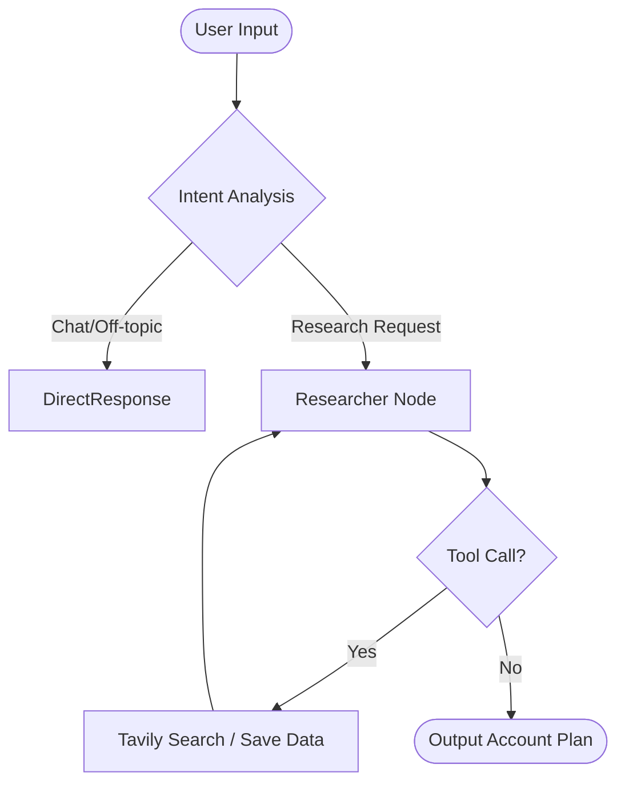

# 🕵️‍♂️ Company Research Assistant (Account Plan Agent)

  

An AI Agent that acts as a **Senior Corporate Strategist**. It autonomously researches companies, gathers live financial data, and generates structured Account Plans (SWOT, Competitors, Opportunities) for sales teams.

## 🌟 Key Features
* **🧠 Agentic Reasoning:** Uses a ReAct pattern to search, verify, and save data.
* **🛡️ Persona Guardrails:** Semantic routing rejects off-topic chat ("Pizza?") and guides confused users.
* **⚖️ Conflict Detection:** Pauses execution to ask the user when finding conflicting data (Human-in-the-loop).
* **⚡ Rate-Limit Protected:** Implements memory trimming to prevent API token overflows on the free tier.

## 🏗️ Architecture

The agent is modeled as a **Cyclic State Graph**, not a linear chain.

	
## 🛠️ Tech Stack
* **Orchestration:** LangGraph (State management & Loops).
* **LLM:** Groq (Llama 3.3 70B Versatile).
* **Tools:** Tavily API (Real-time web search).
* **UI:** Chainlit (Chat interface).

## 🚀 Setup & Run
	1. Clone & Install
	git clone https://github.com/ChakreshKVS/Company-Research-Assistant.git
    cd company-research-agent
	python -m venv venv
	# Activate venv (Windows: venv\Scripts\activate | Mac: source venv/bin/activate)
	pip install -r requirements.txt
	
	2. Configure Keys Create a .env file:
	GROQ_API_KEY=gsk_...
	TAVILY_API_KEY=tvly-...
	
	3. Run
	chainlit run app.py -w
	
## Design Decisions
Llama 3.3 70B (Groq): Chosen over the 8B model because the 8B model frequently crashed on complex JSON tool calls. The 70B model offers superior instruction-following for the "Senior Strategist" persona.

Memory Trimmer: Extensive research fills context windows quickly. I implemented logic to strictly keep only the last 4 conversation turns to avoid hitting Groq's 6k token/minute rate limit.

Binary Execution Mode: To prevent infinite loops (Search -> Speak -> Search), the agent is forced to either Search OR Speak in a single turn, but never both simultaneously.
